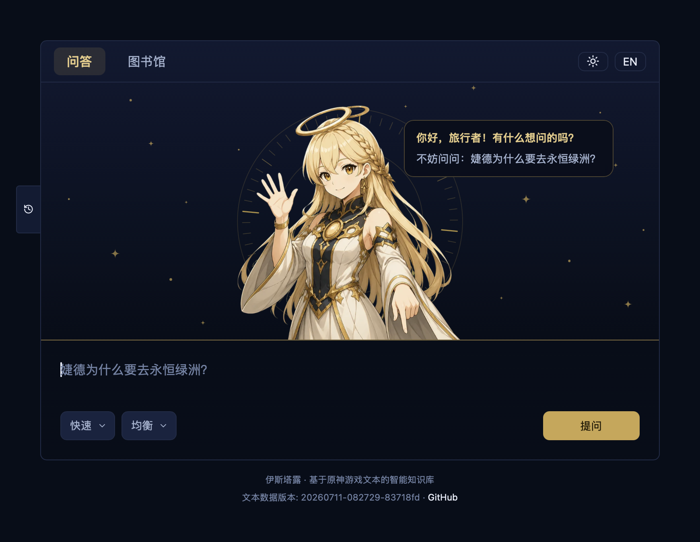

# Istaroth

Istaroth is a Retrieval-Augmented Generation (RAG) system for Genshin Impact that extracts, cleans, and structures textual content to answer lore questions about the world of Teyvat.

Special thanks to Dimbreath for his wonderful work on AnimeGameData!

## Texts Included

Istaroth extracts and structures text from AnimeGameData, plus a third-party lore manual:

- Quests (main, story, world, and event questlines)
- Dialogue (in-game talks, talk groups, hangout events, cutscene subtitles)
- Characters (character stories, voicelines)
- World & lore (living beings, anecdotes, achievements, events, rich ore reserves)
- Items & readables (readables, books, weapons, artifact sets, wings, costumes, material types)
- Shishu (诗漱) lore manual (third-party)

## Getting Started

### Python Environment Setup

Requires **Python 3.14** (see `.python-version`) and [uv](https://docs.astral.sh/uv/).

```bash
uv sync              # creates .venv and installs all dependencies
```

By default, `uv sync` installs CPU-only PyTorch from the [pytorch-cpu index](https://download.pytorch.org/whl/cpu) (~200MB on Linux instead of ~4GB of CUDA wheels). Local embedding builds use `ISTAROTH_TRAINING_DEVICE=cpu` by default; override via `.env.common` if needed.

If you plan on doing development, see [DEVELOPMENT.md](DEVELOPMENT.md) for pre-commit hooks and dependency management.

### Checkpoint

A checkpoint currently mainly consists of the vectorstore and various other data stores containing cleaned game texts. You can either grab a pre-trained checkpoint from the [release page](https://github.com/isundaylee/istaroth/releases), or build your own following the instructions in [DEVELOPMENT.md](DEVELOPMENT.md). If you grab a pre-trained checkpoint, be sure to use it with the corresponding Git commit hash.

## Web UI

Istaroth ships a web UI for exploring Teyvat's lore: ask lore questions in Chinese or English and get answers grounded in the game text with source citations, or browse the underlying corpus (quests, characters, readables, and more) in the library view.



See [DEVELOPMENT.md](DEVELOPMENT.md#docker-compose-dev) for instructions on launching the web UI via Docker Compose.

## MCP Server

Istaroth provides an MCP (Model Context Protocol) server that lets Claude query the RAG system directly, with Docker, local (stdio), and remote (HTTP) deployment options. See [MCP.md](MCP.md) for setup and example queries.
